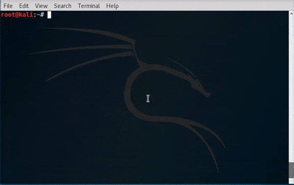

===============
Getting Started
===============
-------------------
What is Wifiphisher
-------------------
Wifiphisher  is a security tool that mounts automated victim-customized phishing attacks against
WiFi clients in order to obtain credentials or infect the victims with malwares. It is a social
engineering attack that does not include any brute forcing. It
is an easy way for obtaining credentials from captive portals and third party login pages
(e.g. in social networks) or WPA/WPA2 passwords.

----------------------
How to get Wifiphisher
----------------------
There are three ways to obtain Wifiphisher

^^^^^^^^^^^^
Using Pip
^^^^^^^^^^^^

This method is the simplest and easiest way to obtain Wifiphisher. All you have to do is
run the following command in the terminal

.. code-block:: bash

    [sudo] pip install --upgrade wifiphisher

.. warning::
    ``pip`` must be installed on your system.

.. seealso::
    pip_ and ``pip --help`` for more information.

.. _pip: https://pypi.python.org/pypi/pip/

^^^^^^^^^^^^
Using git
^^^^^^^^^^^^
This method involves using the ``git clone`` command. Simply run the following command from the
terminal

.. code-block:: bash

    git clone https://github.com/wifiphisher/wifiphisher.git

.. image:: _static/getting_started/install_git.gif

.. warning::
    ``git`` must be installed on your system.

.. seealso::
    Git_ and ``git clone --help`` for more information.

.. _Git: https://git-scm.com/

^^^^^^^^^^^^^^^^^^^^^^^
Using browser
^^^^^^^^^^^^^^^^^^^^^^^
This method involves downloading all the files using a browser.

#. Visit the projects page on Github_
#. Press the ``clone or download`` button
#. Click the ``Download ZIP`` button
#. Unzip the files

.. _Github: https://github.com/wifiphisher/wifiphisher
