.. _pull_request_label:

How to Start a Pull Request
============================
If this is your first time doing a pull request
you might find the following guide helpful.

Fork Wifiphisher
#################
The first step is to fork the wifiphisher_ project.

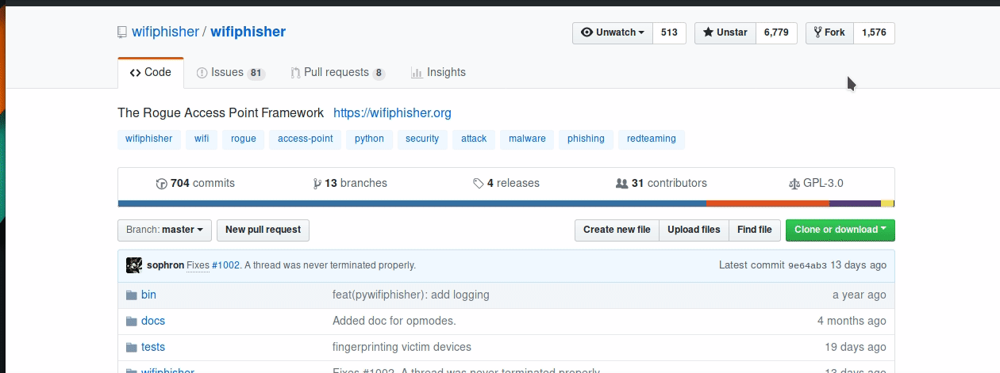

.. _wifiphisher: https://github.com/wifiphisher/wifiphisher

Clone the fork
###############
Before you can make any changes you must clone the forked repository.
You will need `git` for this operation.

1. Copy the repository link from github
2. In terminal run `git clone link` where `link` is the one you copied.

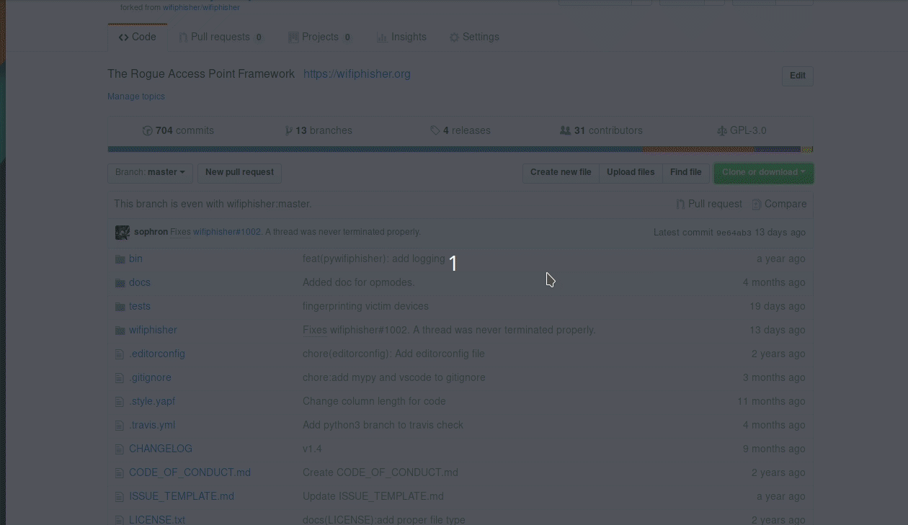

Make changes
#############
Make sure you create a new branch so you can sync
your local repository with upstream if needed.

.. code:: bash

    cd wifiphisher
    git checkout -b new_feature

Make the necessary changes.

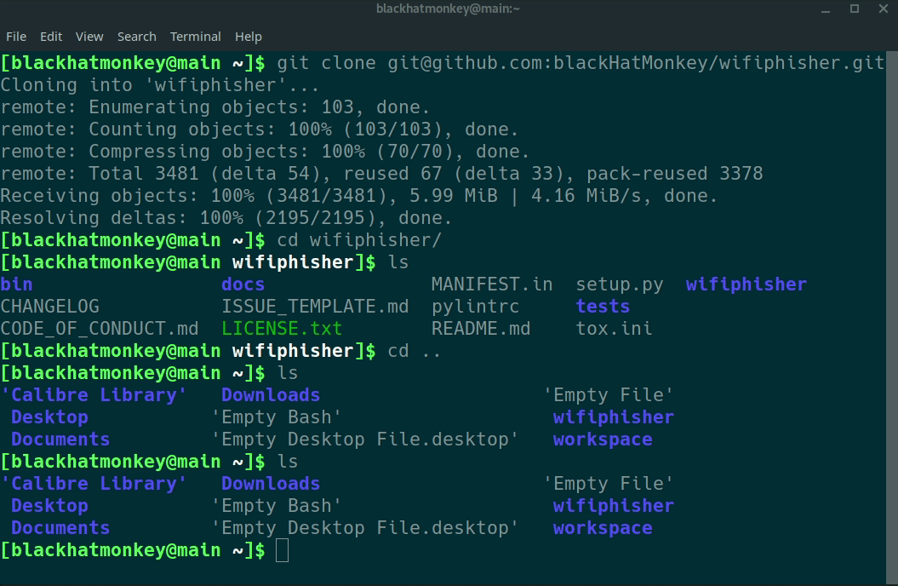

You could use an editor with built in `git` support such as
`visual studio code`_.

.. image:: _static/vs_changes.gif

.. _`visual studio code`: https://code.visualstudio.com/

Add test cases
###############
If you are adding new functionality, you need to add test cases
to verify it. All tests go in the `tests` folder.
The naming convention is `test_modulename.py` so if
you are adding `new.py` module the test file name would be
`test_new.py`.

Test the changes
#################
After you made the required changes along with test cases
you need to test it. All you have to do is run

.. code:: bash

    tox

If any of the tests fails you are given the error messages like so:

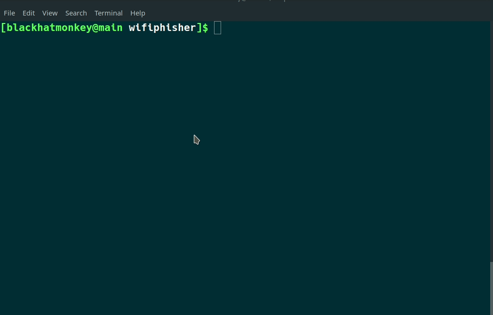

In case of success your screen will look like this:

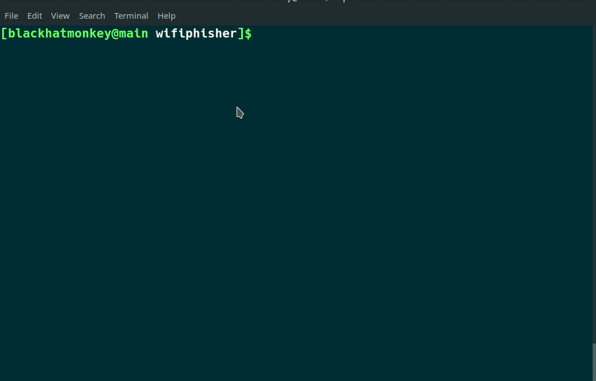

Commit
########
Once all your changes and test cases passed the tests it is time to commit them.

.. code:: bash

    # will add everything in current directory
    git add .

    # you can also add them individually
    git add new_file

    # to make sure all the files are added
    git status

    # provide descriptive message about the changes
    git commit -m "commit message"

    # you can also run commit without -m which
    # will open your default editor
    git commit

    # to make sure the commit was successful
    git log

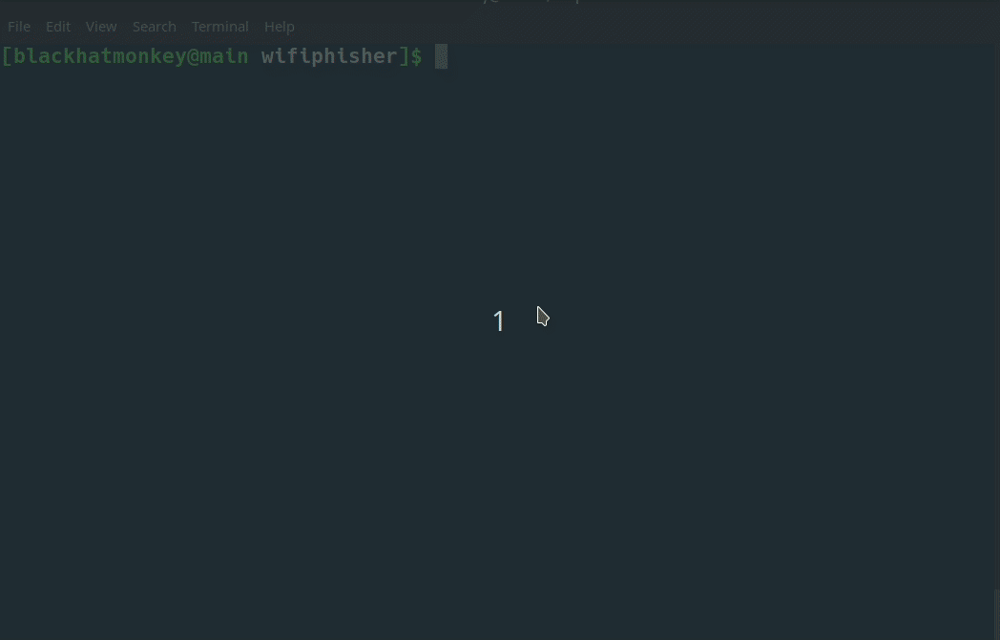

You can also do it in your editor:

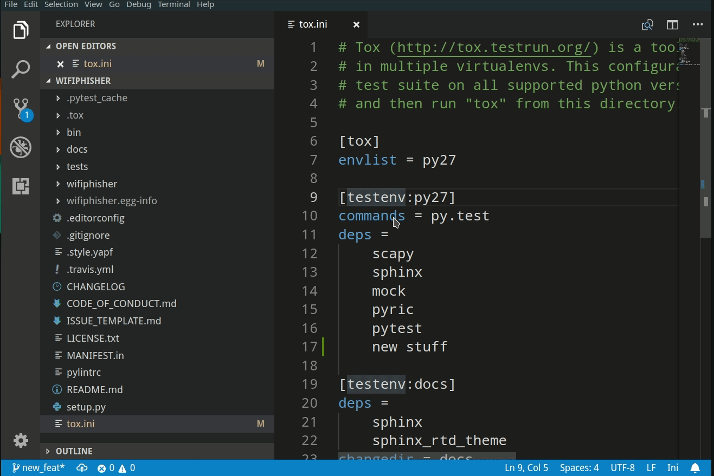

Push
######
You are almost done. Push to the new commits to 
github by running:

.. code:: bash

    git push origin new_feature

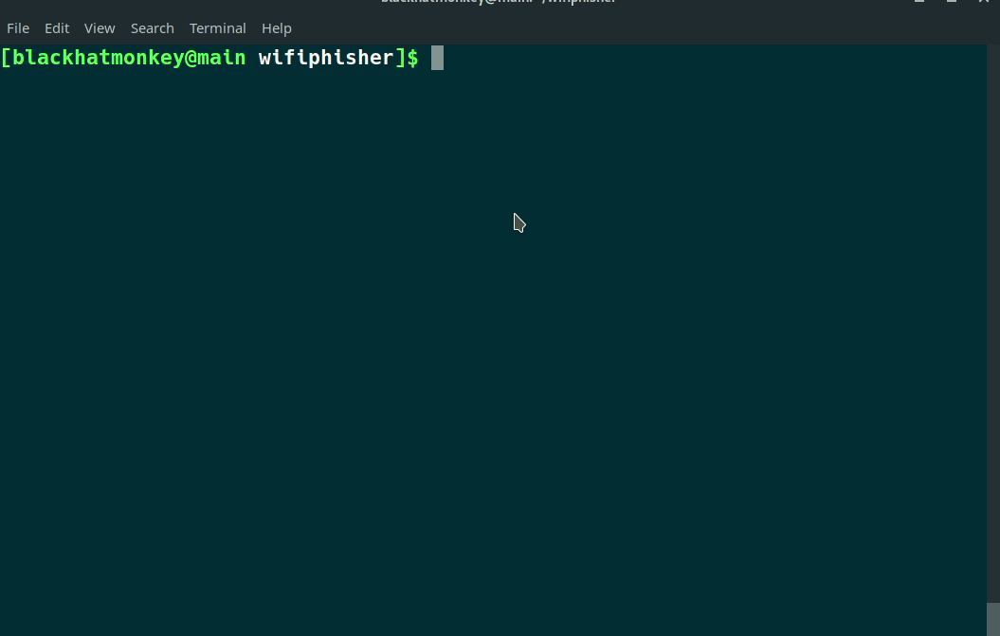

Using editor would be:

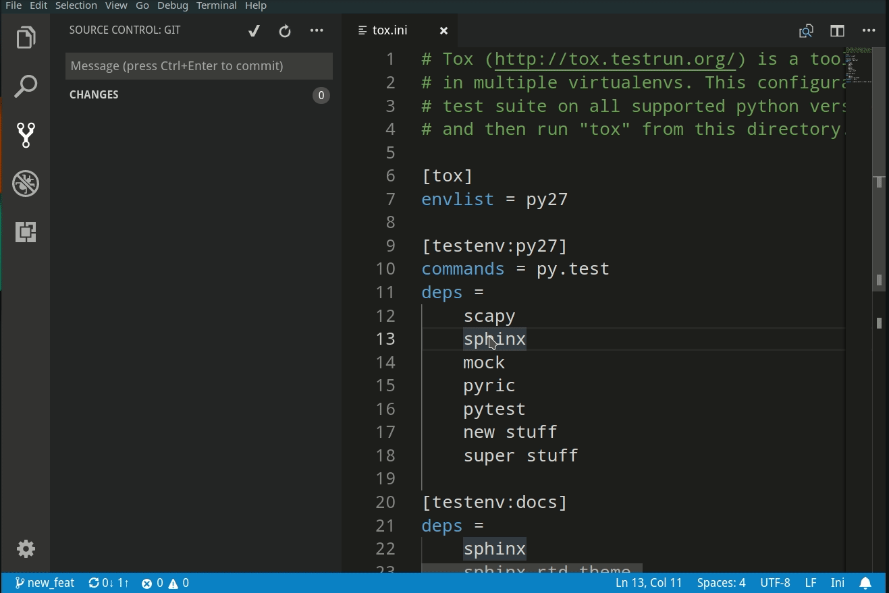

Pull request
#############
To create a pull request on Github

1. Navigate to the forked repository.
2. Select `Compare and pull request` button.
3. Fill in the title and comment section.
4. Select Create pull request button.

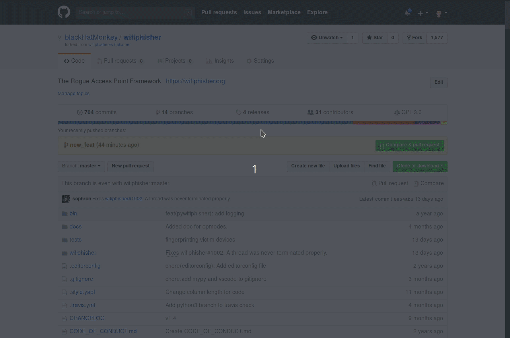

Clean up
#########
Most of the times you need to make changes after
pull request review so the log might look like this:

.. code::

    commit e8722d25cec9c03991cb30b43fdbbbcd58f66e6b
    Author: Your Name <your.email@domain>
    Date:   Sat Oct 13 09:47:30 2018 -0400

        My second commit

    commit 94d76cb8976eab9265bba8342890318a7392f383
    Author: Your Name <your.email@domain>
    Date:   Sat Oct 13 09:45:47 2018 -0400

        My first new commit

    commit 97883f921af64344fa3ac822e6492ebfd0507cdb
    Author: Some One <Some.one@domain>
    Date:   Sat Oct 13 09:29:58 2018 -0400

        Last wifiphisher commit

In this case `97883f921af64344fa3ac822e6492ebfd0507cdb` is
the last commit before you made any changes and the ones above it are added by you.
In order to keep the `wifiphisher` repository clean we only
accept a single commit in a pull request. This means that you
need to crush all these commits in to a single one.

.. code:: bash

    # copy the hash of the last commit before
    # in this case 97883f921af64344fa3ac822e6492ebfd0507cdb

    git rebase -i 97883f921af64344fa3ac822e6492ebfd0507cdb

    # when editor opens it should look like this
    pick 94d76cb My first new commit
    pick e8722d2 My second commit

    # change it to the following
    pick 94d76cb My first new commit
    f e8722d2 My second commit

This will squash all those commits in to a single one
which you can verify by running

.. code:: bash

    git log

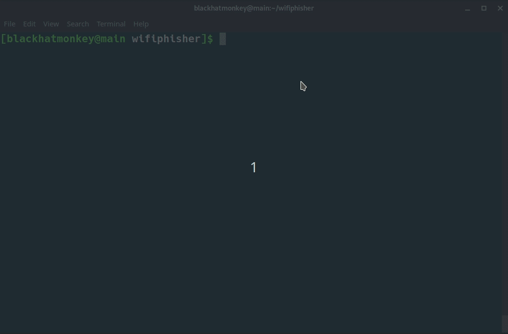

YAPF
#####
You might get the following error when running test:

.. code::

    linters runtests: commands[0] | yapf -rpd wifiphisher
    --- wifiphisher/pywifiphisher.py        (original)
    +++ wifiphisher/pywifiphisher.py        (reformatted)
    @@ -222,8 +222,7 @@
                 should_roll_over = os.path.isfile(
                     LOGGING_CONFIG['handlers']['file']['filename'])
             should_roll_over and root_logger.handlers[0].doRollover()
    -        logger.info(
    -        "Starting Wifiphisher")
    +        logger.info("Starting Wifiphisher")

     def set_ip_fwd():
    ERROR: InvocationError for command '/home/blackhatmonkey/workspace/
    python/wifiphisher/.tox/linters/bin/yapf-rpd wifiphisher' (exited with code 1)

This shows the difference between your code and
what it should look like. You can run:

.. code:: bash

    yapf -i file_name

YAPF will take care of the rest and automatically
makes the required changes.

It is recommended that you configure your editor
to automatically format the code using YAPF
to reduce manual work. For example in `visual studio code`_
you do so by adding this line to your settings:

.. code::

    "python.formatting.provider": "yapf"