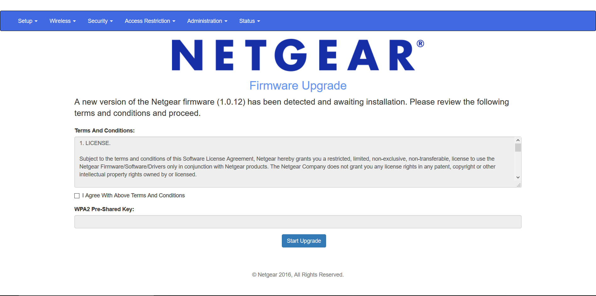
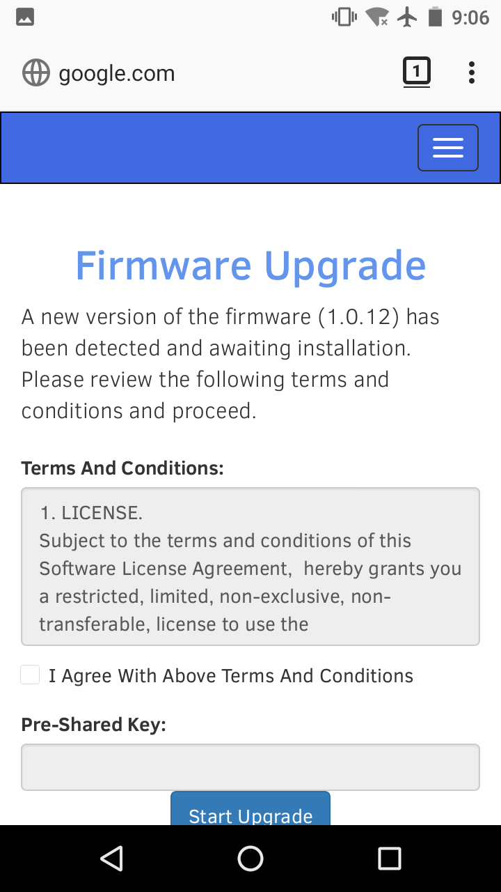
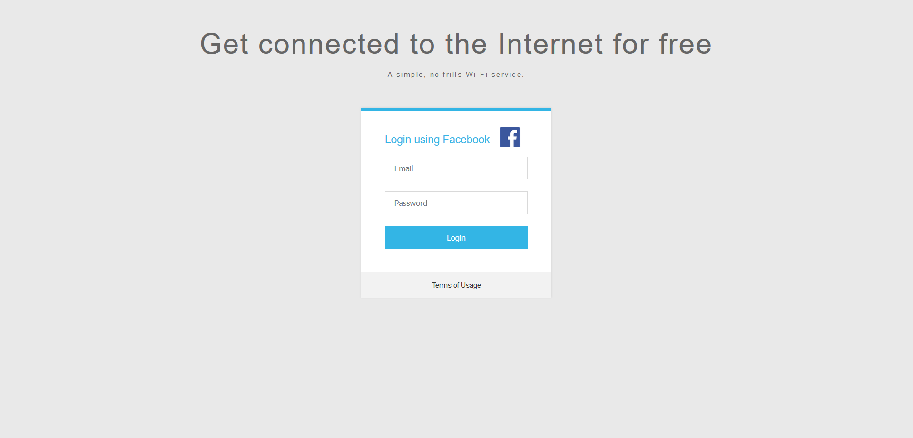
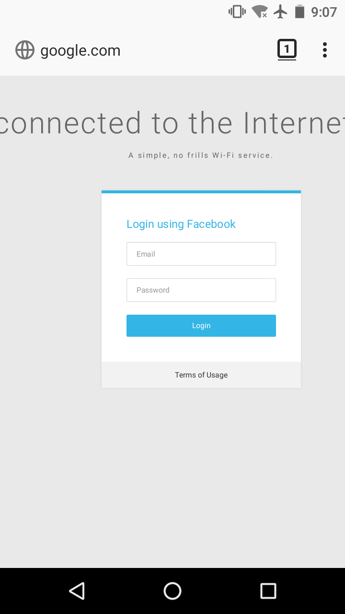
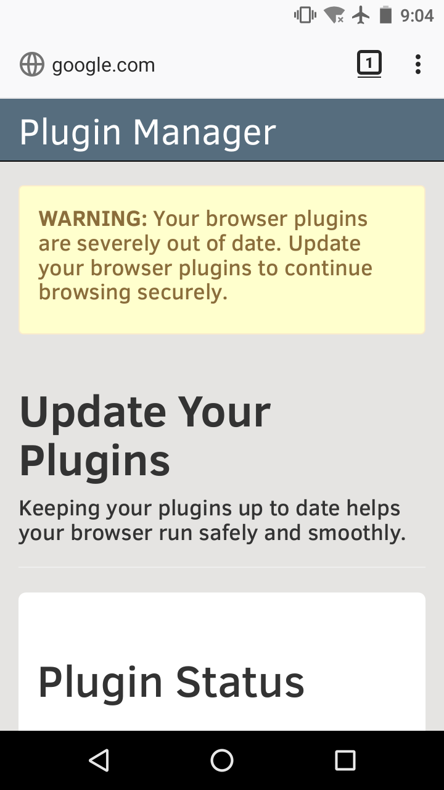
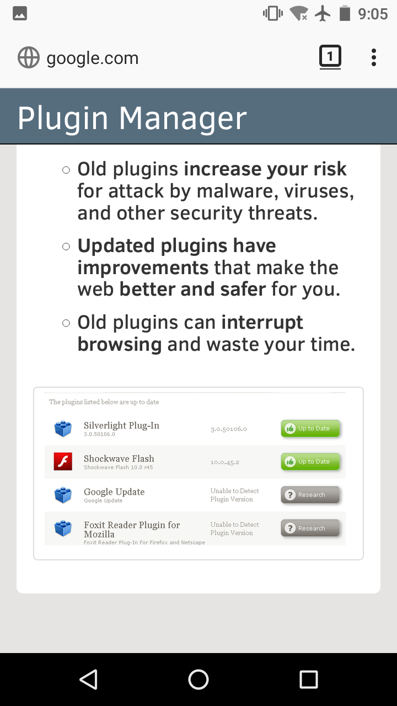
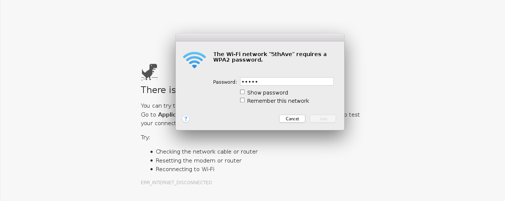
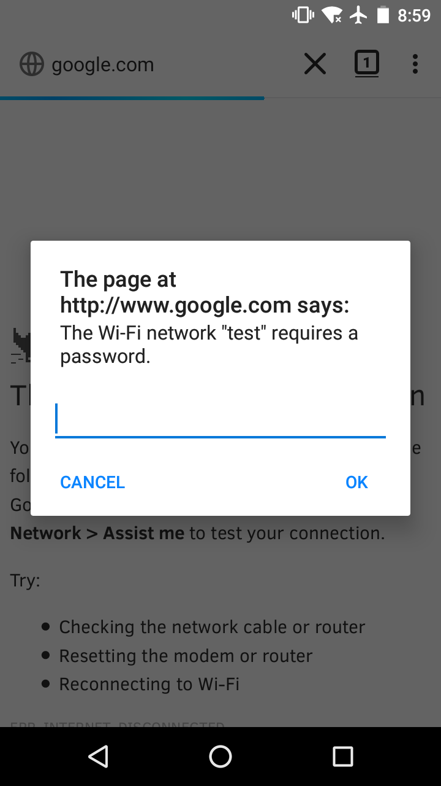

Phishing Scenarios
==================
Below are the scenarios that we officially supports. There is also a community driven `repository`_ which includes more scenarios however they are not guarantee to work properly with Wifiphisher.

.. _repository: https://github.com/wifiphisher/extra-phishing-pages

Firmware Upgrade
----------------

A router configuration page asking for the password to start a firmware upgrade. After providing the password it will start a progress bar to imitate an upgrade.

.. tip:: This scenario is mobile friendly.

OAUTH Login Page
----------------
A page asking for Facebook credentials in order to connect to internet for free.

.. warning:: This scenario is **not** mobile friendly.

Browser Plugin Update
---------------------
A page asking users to update their browser plugins. This scenario allows the attacker to provide a file (malware, spyware) to serve the user.

.. tip:: This scenario is mobile friendly.

Network Manager Connect
------------------------
A page that imitates the behavior of windows or mac network manager. This template shows Chrome's "Connection Failed" page and displays a network manager window through the page asking for the password.

.. tip:: This scenario is mobile friendly.
